[TOC]


### **About **

This document is a setup guide for building idastealth IDA plugin and related components available from https://github.com/nihilus/idastealth.


[TOC]


### RDTSCEmu {#rdtscemu}

This project is a driver project that produces a .sys driver.

Open RDTSCEmu solution separately opening the solution file under idastealth\src\RDTSCEmu\driver\RDTSCEmu.sln.


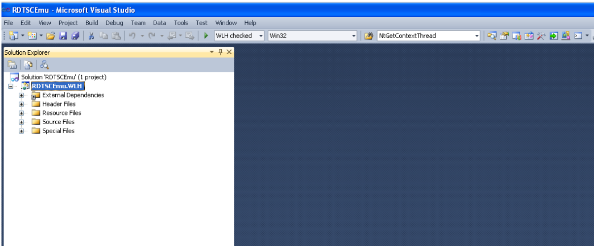


Drivers have a NMake section in the Property Pages, like below:


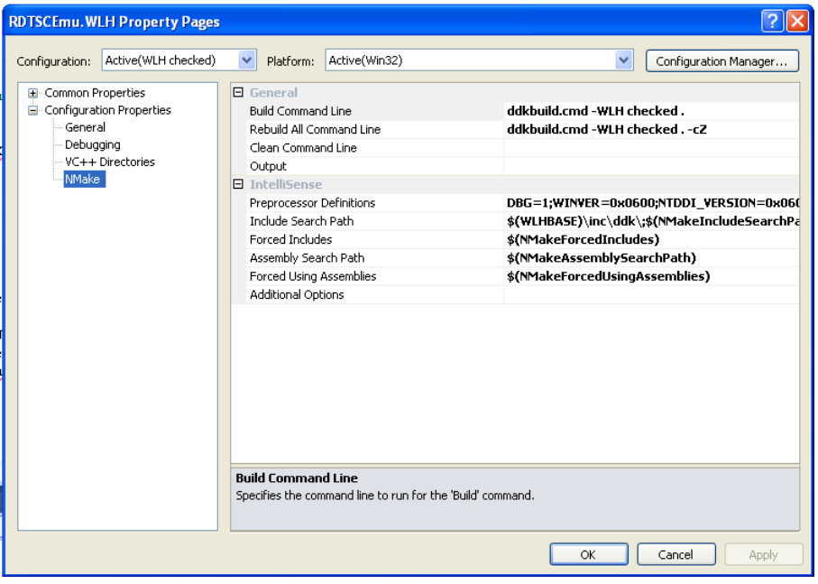


The build produces a sys driver file here:


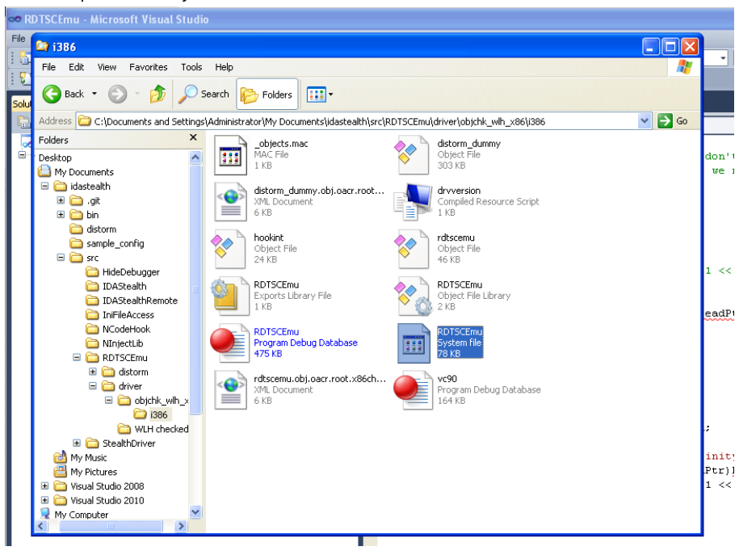


**Problem: Windows XP SP3 32-bit**

**Solution:**

The code was tested for 32-bit only and Windows XP SP3.

winver gives:


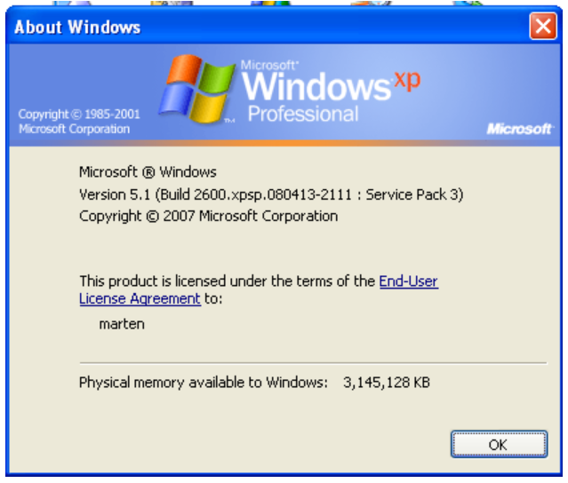


**Problem: Visual Studio 2010**

**Solution:**

You need Visual Studio 2010 in order to build the driver. Install VS Studio 2010 with VC++ support.


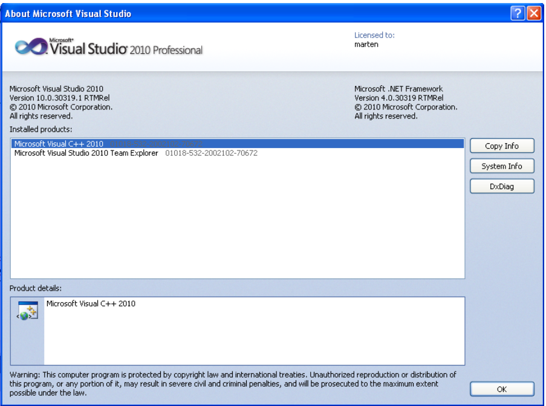


**Problem: ddkbuild.cmd needs WinDDK in order to build drivers**

**Solution:**

Download WinDDK\7600.16385.1 and install it to C:\WinDDK\7600.16385.1


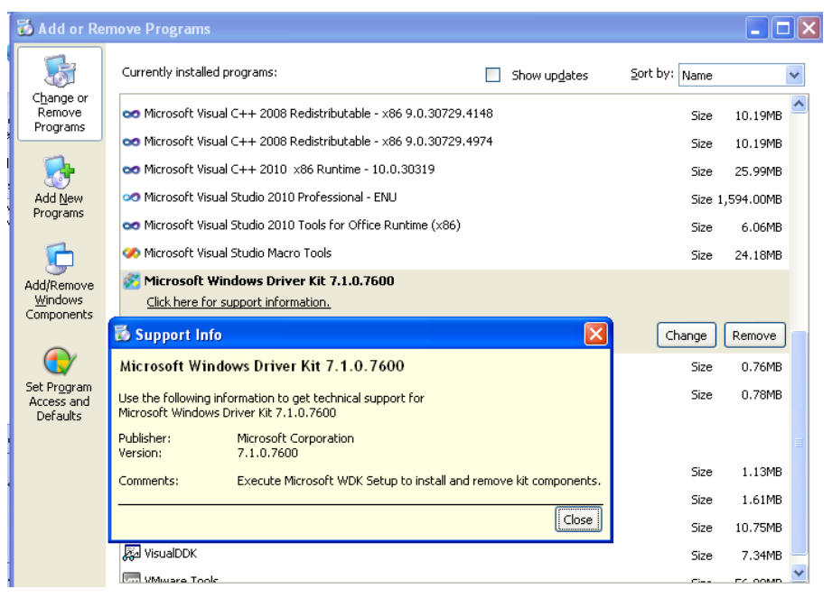


**Problem: Install the driver build script ddkbuild.cmd **

**Solution:**

Download v7.4 from  [https://www.osronline.com/OsrDown.cfm/ddkbuild_v74r43.zip](https://www.osronline.com/OsrDown.cfm/ddkbuild_v74r43.zip) and place it into C:\ddkbuild\ddkbuild.cmd.

Alternative: Copy it from the root folder of idastealth.


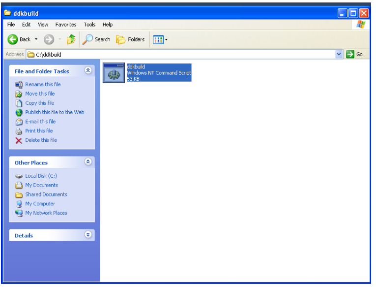


**Problem: Build can’t find the ddkbuild.cmd file**

**Solution:**

Driver projects cannot find ddkbuild.cmd if we don’t tell visual studio where to look for it.

Add the path to the executable ddkbuild.cmd in the Executable Directories path as below.

In the example below C:\ddkbuild\ddkbuild.cmd was placed.


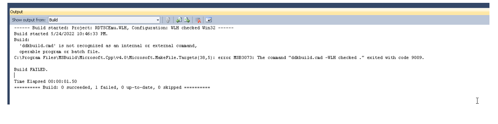


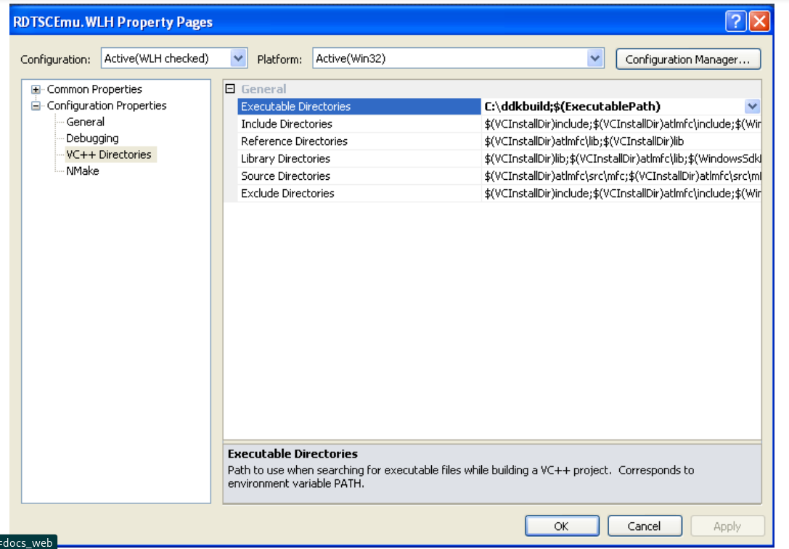


**Problem: **To build a driver ddkbuild.cmd needs to know the location of the Windows DDK directory, thus we need to set  the %WLHBASE% environment


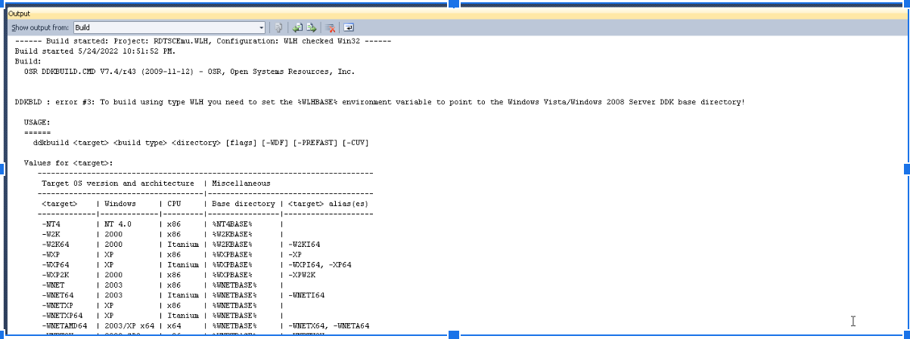


**Solution:**

Add the following line to C:\ddkbuild\ddkbuild.cmd

set WLHBASE=C:\WinDDK\7600.16385.1

Make sure the WinDDK is located there.


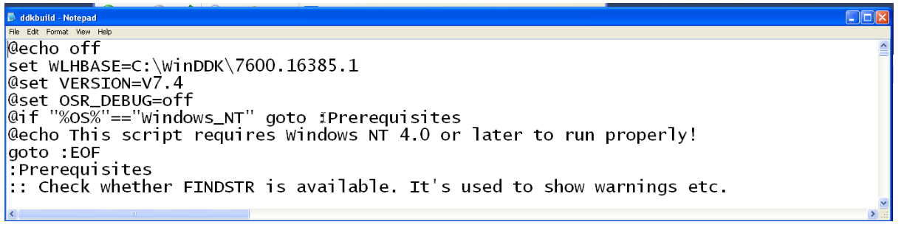


**Problem: **There is a build error, an unresolved symbol for _KeSetAffinityThread is missing


**Solution:**

The code doesn’t work, don’t know why, so we have to modify it.

We define a function pointer, `KeSetAffinityThreadPtr and populate it with the address of this function with the help of the windows function MmGetSystemRoutineAddress`


1. **Comment out the following line (Line 3) in HookInt.cpp**

//extern "C" KAFFINITY KeSetAffinityThread(IN PKTHREAD Thread, IN KAFFINITY Affinity);


2. **Replace switchToCpu with the below code:**


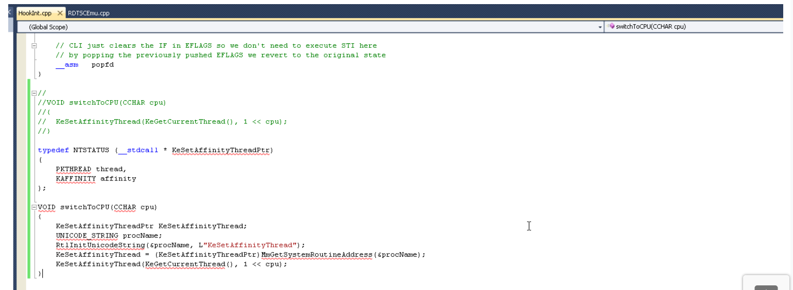


```
//
//VOID switchToCPU(CCHAR cpu)
//{
//	KeSetAffinityThread(KeGetCurrentThread(), 1 << cpu);
//}

typedef NTSTATUS (__stdcall * KeSetAffinityThreadPtr)
(
	PKTHREAD thread,
	KAFFINITY affinity
);

VOID switchToCPU(CCHAR cpu)
{
	KeSetAffinityThreadPtr KeSetAffinityThread;
	UNICODE_STRING procName;
	RtlInitUnicodeString(&procName, L"KeSetAffinityThread");
	KeSetAffinityThread = (KeSetAffinityThreadPtr)MmGetSystemRoutineAddress(&procName);
	KeSetAffinityThread(KeGetCurrentThread(), 1 << cpu);
}
```


**Problem: **You want to test the driver

**Solution:**

Use OSR Driver Loader program to load it.


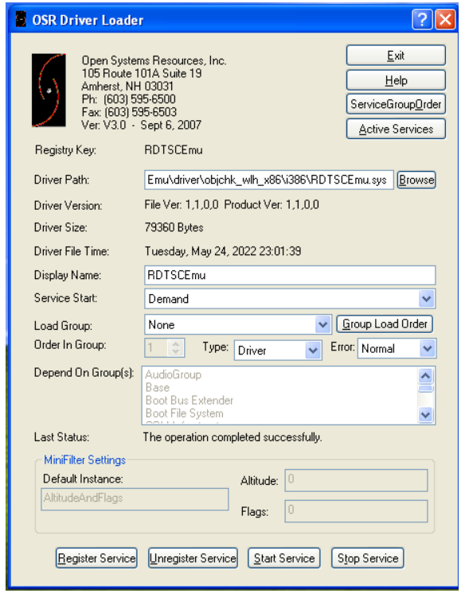


**Problem: **Test that RDTSC is simulated

**Solution:**

When the driver is loaded, rdtsc instruction will return 0 for both edx and eax:


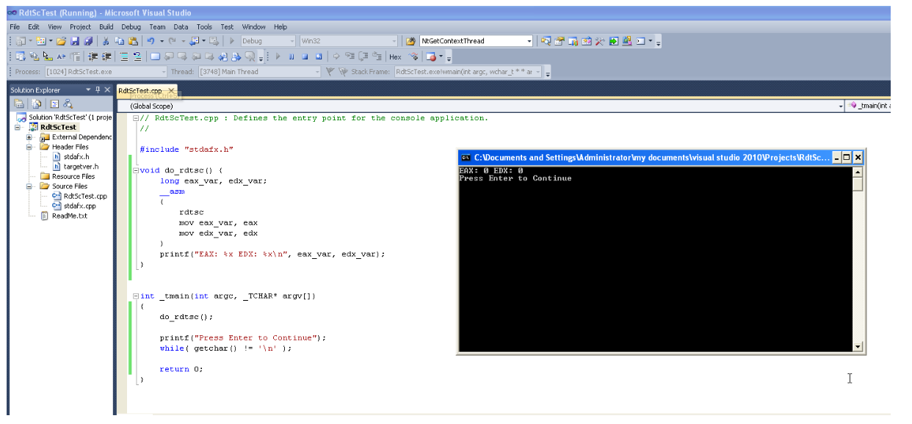


If you unload the driver, it gives the following normal results:

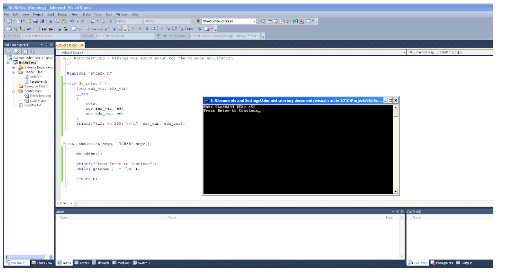


### StealthDriver {#stealthdriver}

This project is a driver project that produces a .sys driver.

Open StealthDriver.W7 solution separately opening the solution file under idastealth\src\StealthDriver\StealthDriver\StealthDriver.W7.sln.

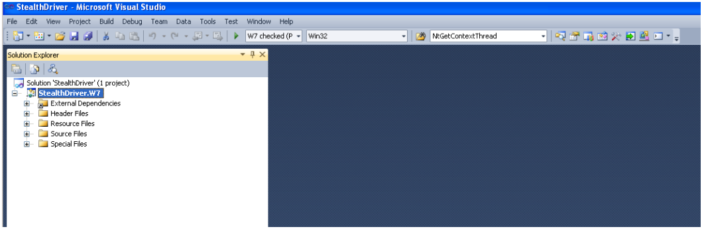


StealthDriver.W7 is a driver so it has a NMake section in the property pages:


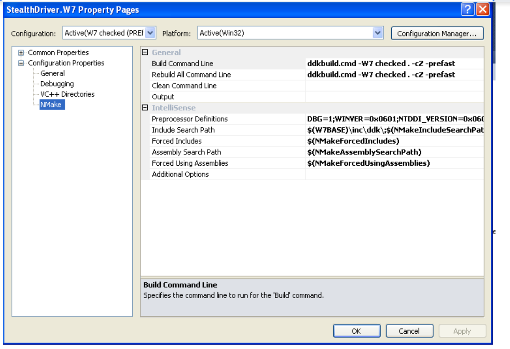


**Problem: Build can’t find the ddkbuild.cmd file**

See above in the RDTSCEmu section.

**Problem: Install the driver build script ddkbuild.cmd **

See above in the RDTSCEmu section.

**Problem: ddkbuild.cmd needs WinDDK in order to build drivers**

See above in the RDTSCEmu section.

**Problem: **Build complains that %W7BASE% environment variable is missing


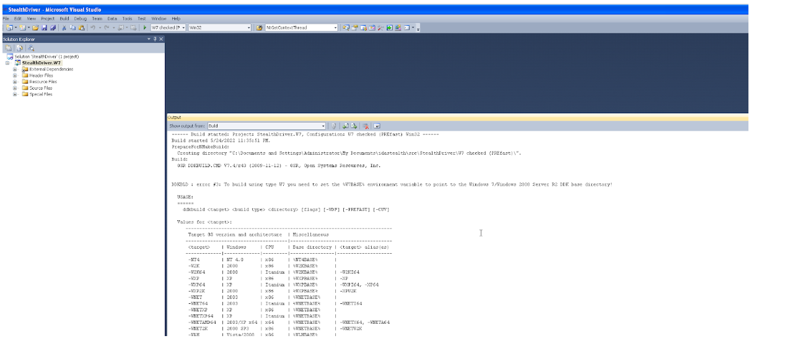


**Solution:**

Add the following line to C:\ddkbuild\ddkbuild.cmd

set W7BASE=C:\WinDDK\7600.16385.1

Make sure the WinDDK is located there.


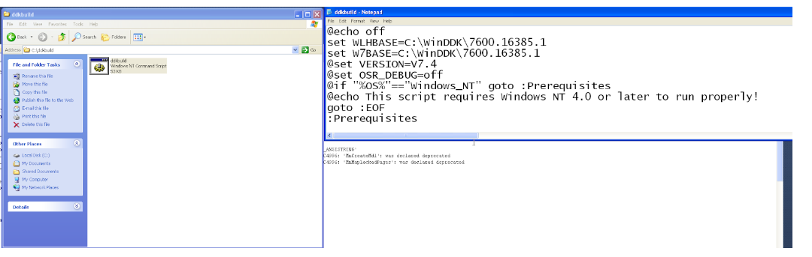


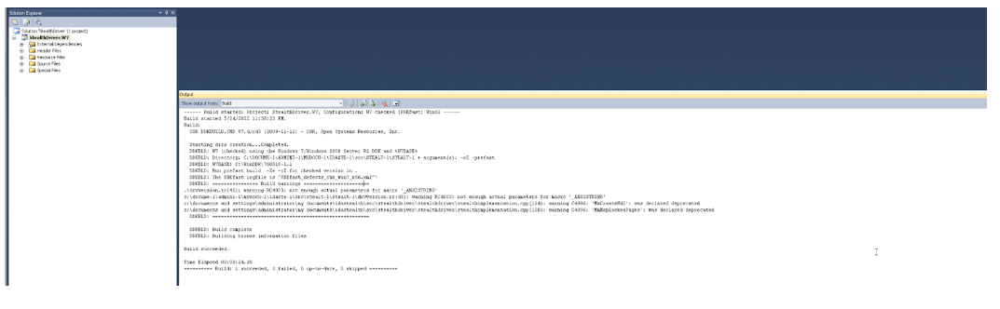


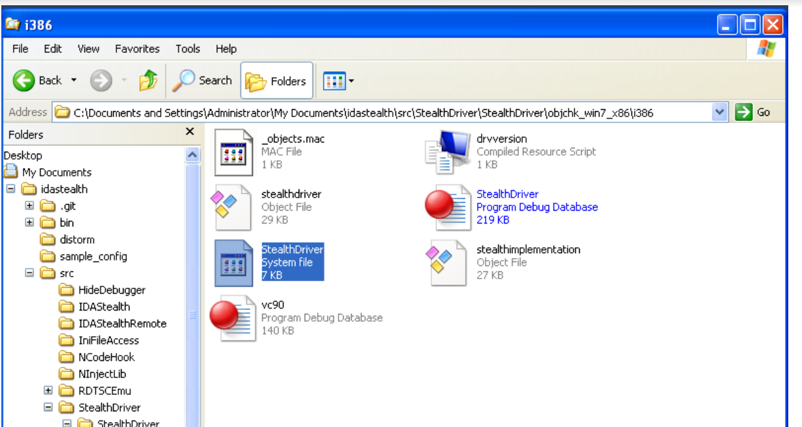


### HideDebugger {#hidedebugger}

This project is a DLL project that produces a .dll driver named hidedebugger.dll

Open the HideDebugger solution separately opening the solution file under idastealth\src\HideDebugger\HideDebugger.sln.


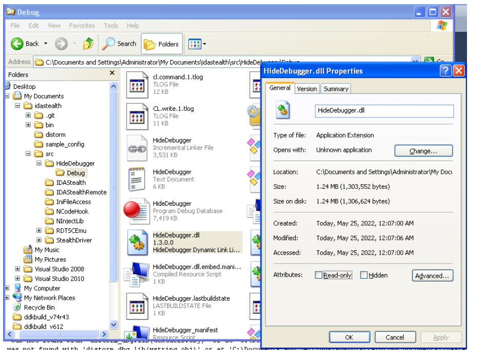


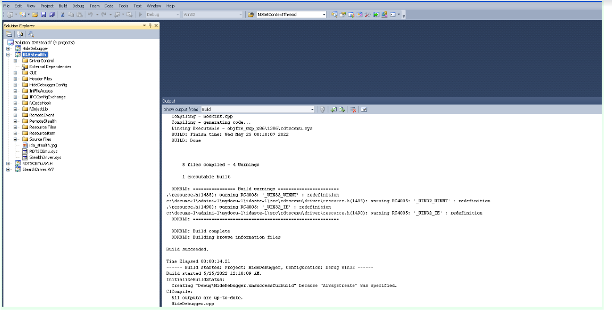


**Problem: **Build complains some boost include files are missing


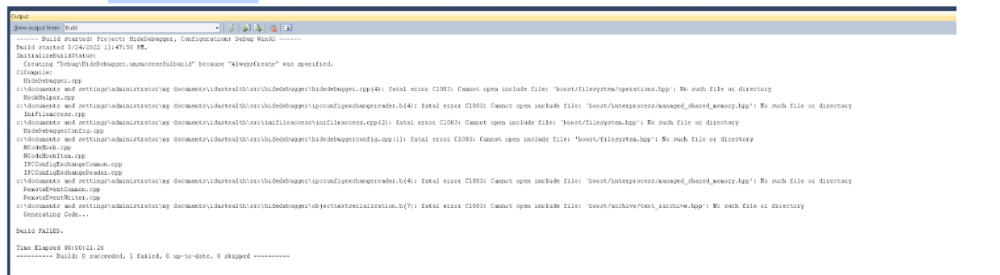


**Solution 1. Download boost project headers for 1.43.0**

The following boost project file contains include files for boost 1.43.0.

Download the boost library project version 1.43.0 from [https://www.boost.org/users/history/version_1_43_0.html](https://www.boost.org/users/history/version_1_43_0.html) [http://sourceforge.net/projects/boost/files/boost/1.43.0/boost_1_43_0.zip](http://sourceforge.net/projects/boost/files/boost/1.43.0/boost_1_43_0.zip) and extract into the folder C:\boost\boost_1_43_0.


**Solution 2. Tell Visual Studio where to look for boost headers**


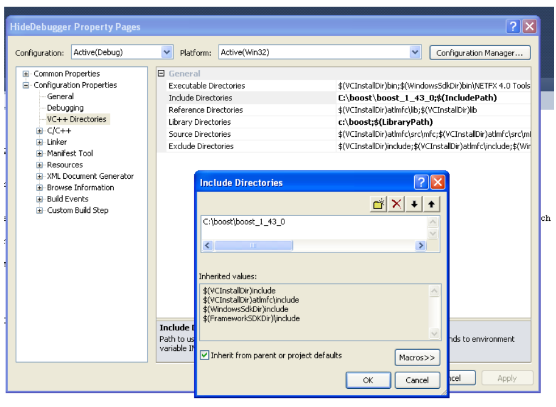


**Problem: Build fails with error, **

c:\program files\microsoft visual studio 10.0\vc\include\xutility(2503): warning C4996: 'std::_Copy_backward': Function call with parameters that may be unsafe - this call relies on the caller to check that the passed values are correct.

**Solution:**

To disable this warning, use -D_SCL_SECURE_NO_WARNINGS. See documentation on how to use Visual C++ 'Checked Iterators'

Add _SCL_SECURE_NO_WARNINGS to Preprocessor section in the property pages:


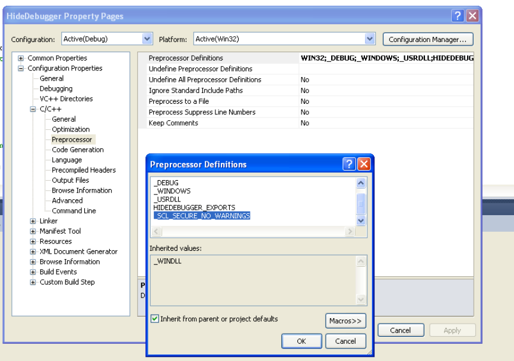


**Problem: Builds fail with errors from linker trying to link against multiple boost libraries**


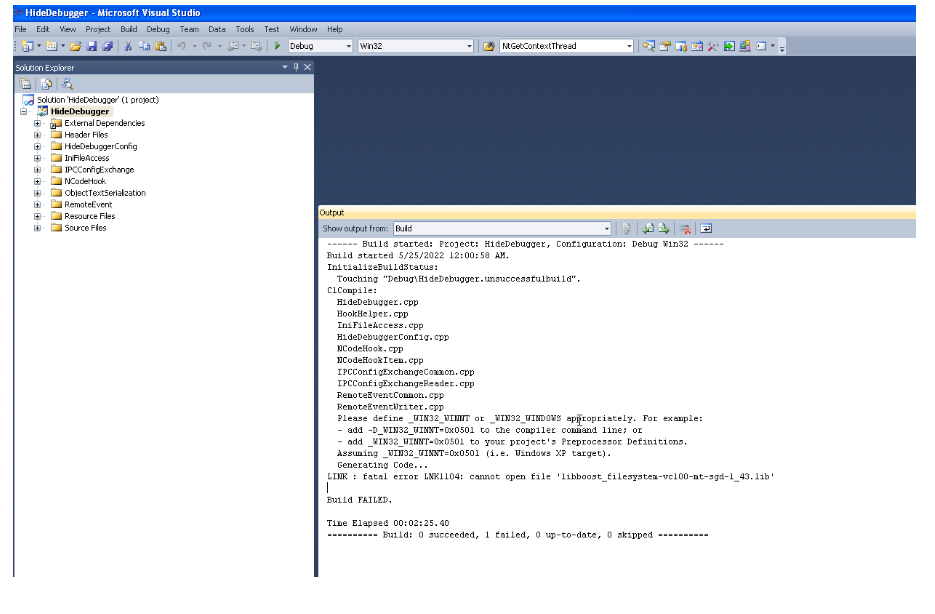


**Solution:**

**Download** the following boost libraries into C:\boost directory then add this directory to Visual Studio so it knows where to find them (,


```
Download: https://sourceforge.net/projects/boost/files/boost-binaries/1.43.0/
C:\boost\libboost_filesystem-vc100-mt-sgd-1_43.lib
C:\boost\libboost_date_time-vc100-mt-sgd-1_43.lib
C:\boost\libboost_regex-vc100-mt-sgd-1_43.lib
C:\boost\libboost_serialization-vc100-mt-sgd-1_43.lib
C:\boost\libboost_system-vc100-mt-sgd-1_43.lib
C:\boost\libboost_thread-vc100-mt-sgd-1_43.lib
C:\boost\libboost_wserialization-vc100-mt-sgd-1_43.lib
```


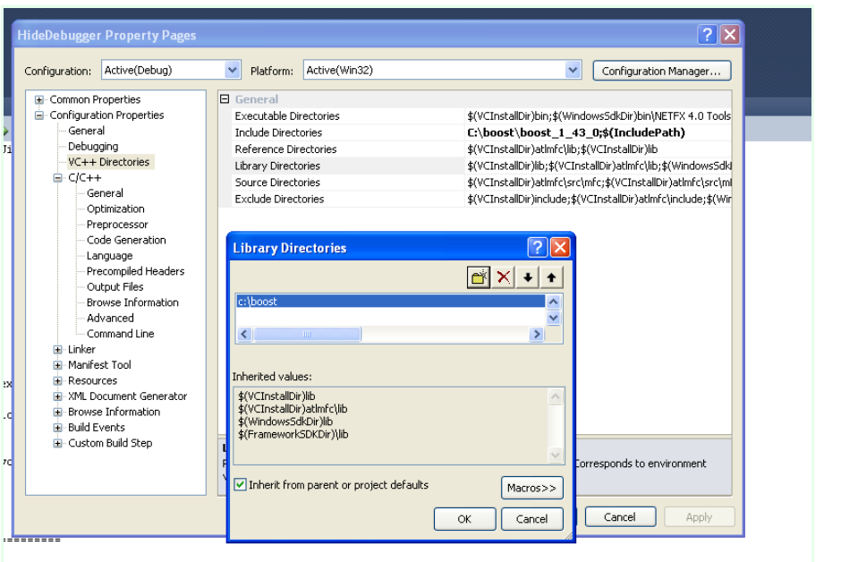


### IDAStealth {#idastealth}

IDAStealth is the IDAPro plugin, when building IDAStealth dependent projects are built before the plugin in the following order:


* RDTSCEmu (RDTSCEmu.sys)
* HideDebugger (HideDebugger.dll)
* StealthDriver.W7 (StealthDriver.sys)


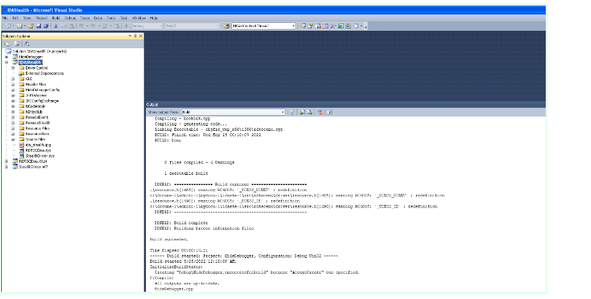


**Problem: **Build complains some boost include files are missing

Solution:

**Solution 1. Download boost project headers for 1.43.0**

The following boost project file contains include files for boost 1.43.0.

Download the boost library project version 1.43.0 from [https://www.boost.org/users/history/version_1_43_0.html](https://www.boost.org/users/history/version_1_43_0.html) [http://sourceforge.net/projects/boost/files/boost/1.43.0/boost_1_43_0.zip](http://sourceforge.net/projects/boost/files/boost/1.43.0/boost_1_43_0.zip) and extract into the folder C:\boost\boost_1_43_0.


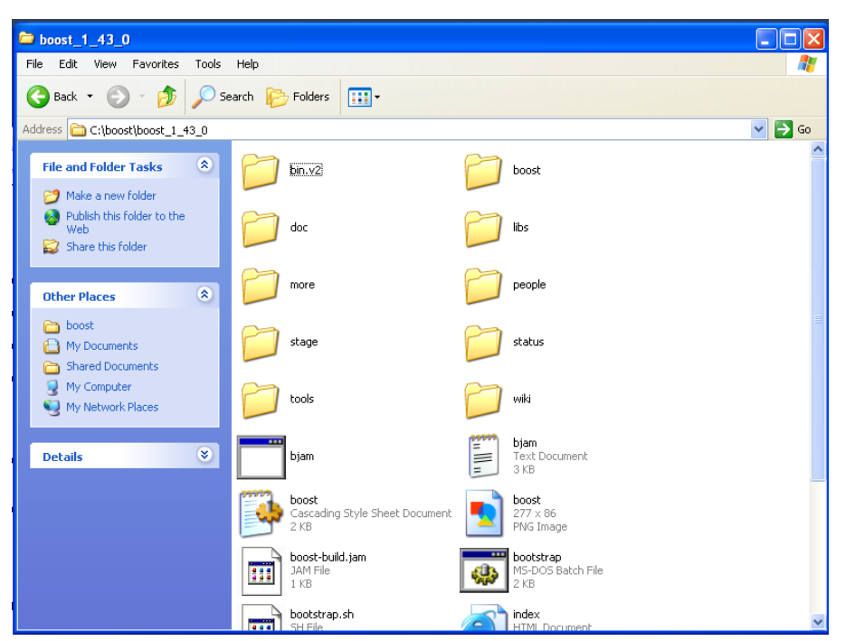


**Solution 2. Tell Visual Studio where to look for boost headers**


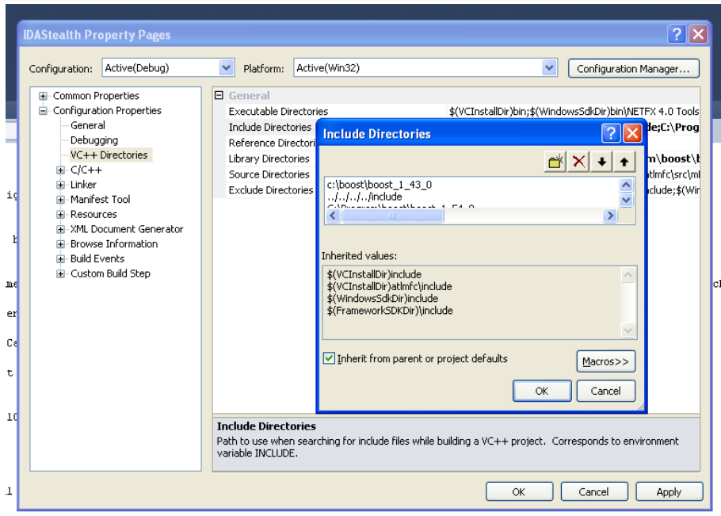


**Problem: **Build complains atlapp.h is missing for WTLCommon.h

The WTL library headers are missing and Visual Studio can’t find them.

**Solution:**

Download WTL80 from `https://sourceforge.net/projects/wtl/files/WTL%208.0/WTL%208.0%20Final/`

and extract into C:\WTL80 then add this folder + C:\WTL80\include to Visual Studio C++ Folders:


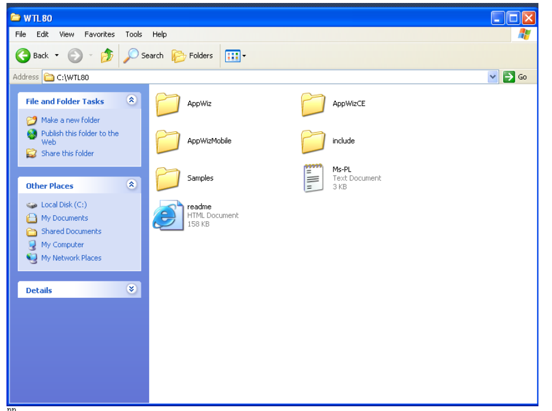


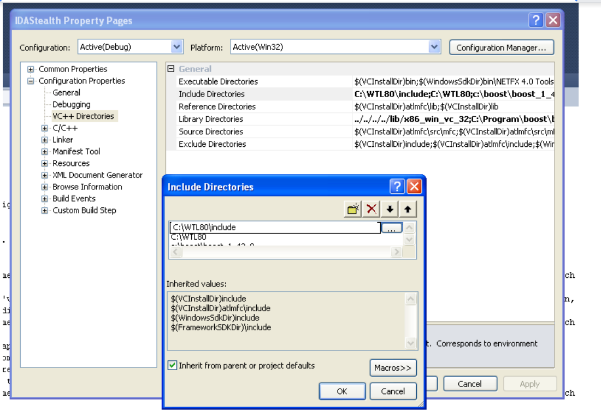


**Problem: **Build complains it can’t find IDASDK headers.

**Solution:**

Add path to IDASDK folder as above.

**Problem: **Build complains it can’t find IDASDK library

**Solution:**

Add path to IDASDK libvc library file.